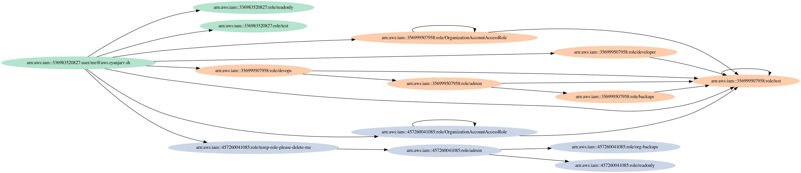

# liquidswards

***Fun fact:** This project is how I discovered the undocumented [Implicit SAR](https://blog.ryanjarv.sh/sar/sar-1-self-assume-role-overview.html) behavior
in AWS IAM. This in turn resulted in (to my knowledge) the first and only backwards incompatible change of it's scale to IAM in 2022, which was announced by
AWS [here](https://aws.amazon.com/blogs/security/announcing-an-update-to-iam-role-trust-policy-behavior/).*

## What does it do?

* Recursively discovers and enumerates access to sts:AssumeRole.
* Makes pretty graphs of accessible roles using GraphViz.


**IMPORTANT**: This tool is relatively new and hasn't had a ton of testing. Make sure you understand what it does
before using it.





https://user-images.githubusercontent.com/4079939/152632976-813343ff-f89d-46b3-80e9-20ee3e9bcff0.mov

## Why?

I wanted a way of mapping assume role paths without depending on IAM. Having studied the code of the several
open-source tools for doing this and written my own, I know this is not easy; additionally, in some edge cases, it's
also not possible. This tool started with a desire to have an alternative to [PMapper](https://github.com/nccgroup/PMapper)
and [AWSpx](https://github.com/FSecureLABS/awspx) that does something similar (specifically for sts:AssumeRole) in the
stupidest possible way. Altogether avoiding IAM parsing allows you to ditch a lot of complexity, have higher
confidence in the results (because of reduced complexity, *not* because other tools are undependable), and may work in
various cases that do not apply to different approaches. The original goal would probably be best thought of as a way
to validate the results of other tools, *not a replacement*. Both PMapper and AWSpx are excellent tools, and they are
likely what you want if you need to discover escalation paths in your accounts.

## Install

Currently, there are release binaries for:

* Darwin -- x86_64 and amd64
* Linux -- x86_64, amd64, and armhf
* Windows -- x86_64 and amd64

The following will install the binaries on Darwin and Linux:

```
tag=$(curl -s https://api.github.com/repos/RyanJarv/liquidswards/releases/latest|jq -r '.tag_name'|tr -d 'v')
curl -L "https://github.com/RyanJarv/liquidswards/releases/download/v${tag}/liquidswards_$(uname -s)_$(uname -m).tar.gz" \
    | tar -xvf - -C /usr/local/bin/ liquidswards
```


## Getting Started

By default we only test for access to roles in the same account(s) as the profiles used with the -profiles argument and enumeration is done using iam:ListRoles.

You can optionally do a few other things as well like search CloudTrail for outbound roles, enumerate roles in a file, or attempt to maintain access through role-juggling either through occasionally refreshing or on revocation notifications through an SQS queue. These things are secondary though and have had less testing.

### Arguments

```
  -debug
    	Enable debug output
  -file string
    	A file containing a list of additional file to enumerate.
  -load
    	Load results from previous scans.
  -name string
    	Name of environment, used to store and retrieve graphs. (default "default")
  -no-save
    	Do not save scan results to disk.
  -no-scope
    	
    	Disable scope, all discovered role ARN's belonging to ANY account will be enumerated for access and additional file 
    	recursively.
    	
  -profiles string
    	List of AWS profiles (seperated by commas) (default "default")    	
  -region string
    	The AWS Region to use (default "us-east-1")
  -scope string
    	
    	List of AWS account ID's (seperated by comma's) that are in scope. Accounts associated with any profiles used are 
    	always in scope regardless of this value.
```

### Plugins


```
  -cloudtrail int
    	
    	Search through the last specified number of hours of CloudTrail logs for sts:AssumeRole events. This can be used to 
    	discover roles that are assumed by other users.
  -no-assume
    	do not attempt to assume discovered roles
  -no-list
    	disable the list plugin
  -refresh int
    	
    	The CredRefreshSeconds rate used for the access plugin in seconds. This defaults to once an hour, but if you want to bypass role 
    	revocation without using cloudtrail events (-sqs-queue option, see the README for more info) you can set this to 
    	approximately three seconds.
  -sqs-queue string
    	
    	SQS queue which receives IAM updates via CloudTrail/CloudWatch/EventBridge. If set, -access-CredRefreshSeconds is not used and 
    	access is only refreshed when the credentials are about to expire or access is revoked via the web console. 
    	
    	Currently, the first profile passed with -profiles is used to access the SQS queue. 
```

### About

liquidswards discovers and enumerates access to IAM Roles via sts:SourceAssumeRole API call's. For each account associated with a profile passed on the command line it will discover roles via iam:ListRoles and searching CloudTrail (if the -cloudtrail argument is used) for sts:SourceAssumeRole calls by other users. For each discovered role sts:AssumeRole will be tested from all currently maintained access, if the call succeeds the discovery and access enumeration steps are repeated from that Role if necessary, and the role is added to the access pool. To summarize, it attempts to recursively discover and enumerate all possible sts:SourceAssumeRole paths that exist from the profiles passed on the command line.

We purposefully avoid relying on IAM parsing extensively due to the complexity involved as well as the goal of discovering what is known to be possible rather then what we think is possible.

The tool maintains a graph which is persisted to disk of the roles that where accessed. This is stored in ~/.liquidswards/<name>/ where name is the argument passed by -name. This can be used to save and load different sessions.


### Enumerate all access available from a set of AWS profiles

Discover roles across several profiles by calling iam:ListRoles. This will enumerate roles via iam:ListRoles using the profile `ryanjarv` as well as any role it can assume from that profile either directly or indirectly.

```sh
liquidswards -profiles aws_profile_1,aws_profile_2
```

### Print credentials of a previously accessed role

```sh
export $(liquidswards arn:aws:iam::123456789012:role/test)
```

### Perform Role Juggling on discovered role's

This refreshes access from the first available inbound neighbor role in the access graph every 60 seconds.

```sh
liquidswards -profiles aws_profile_1,aws_profile_2 -refresh 60
```

### What's with the name?

It's named after the best solo Wu-Tang album.


## Build

This project requires go 1.18 or later.

```
% go build -o liquidswards main.go
% ./liquidswards -h
```

